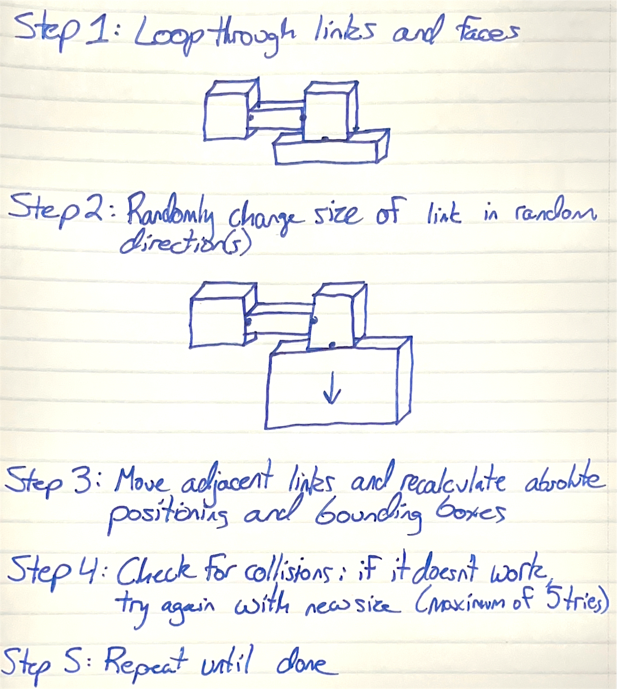
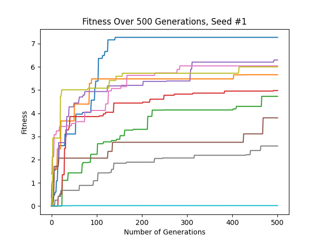
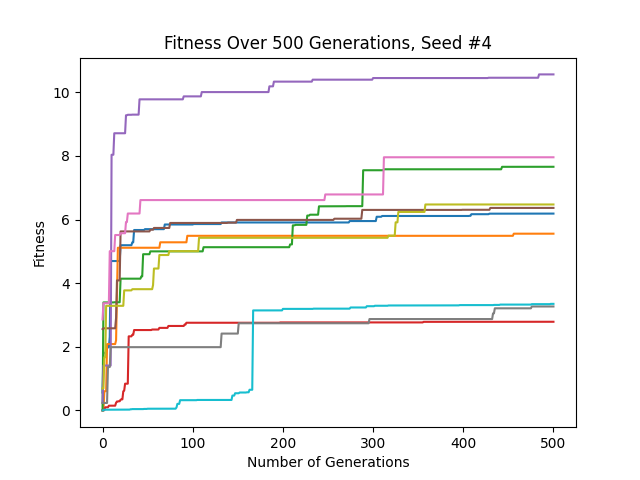

# Evolving 3D Robot

## Basic Idea
This program is designed to create a random, three-dimensional robot out of non-overlapping links and joints. Then, it
"evolves" the creature through a Parallel Hill Climber method: a population of 50 (or less/more) robots are created
randomly, then are randomly mutated from generation to generation. If a mutation improves fitness, it is kept. If it
does not, it is disgarded. The final shown robot is the one that performs the best among the evolved population. The
fitness is a measure of how far in the negative X-axis the robot can travel in a set amount of time. In the graphs
below, a positive fitness is shown as better to improve readability, but in reality, the more negative a fitness, the
better.

## In Depth
First, the code creates a random, three-dimensional body blueprint out of link and joint objects (defined in 
"linkobject.py" and "jointobject.py") in the file "bodyplan.py." It does so by picking a random number of links,
creating a base link (`Link0`), and then one by one, adding a joint and link onto a random face of a random already made
link. If the created joint/link pair overlaps with another, the whole process is scrapped and restarted. All links and
joints have their absolute positions calculated and stored in the link object, as well as the link's axis-aligned 
bounding box. This is then done 50 (`c.populationSize`) times, all a part of Generation #0.  
Next, for each body in the population, the code loops through each synapse and has a small chance of randomly 
reassigning the synapse a different weight. Then, it loops through each link, and for each dimension of each link, there
is a small chance that the link's size in that dimension is randomly reassigned. This mutation process could result in
many or few mutations. As the fitness of the robot increases, the odds of a synapse or link dimension mutating decrease.
This is because large mutations can assist a brand-new robot in getting on the right path, large mutations of 
established robots are less likely to improve the fitness than smaller mutations.  
If a mutation proved successful, i.e. the fitness of the mutated creatrue was better than that of the original, the 
mutated creature replaces the original in the population and creates its own "children." Otherwise, the child is
erased, and the parent creates a new child. This evolution process takes place for 50 (`c.NumberOfGenerations`)
generations. Finally, we find the robot in the final generation with the best fitness in the population and displays it
in a Python GUI.

## Running the Program
Download the files and type `python3 search.py X` into your terminal to run, where _X_ is replaced with any number to
select the seed (it runs `np.random.seed(X)`). A python pop-up should appear with your random creature. Run again for a
new creature, and select a different seed, then back to the original to get replicate your ludobots. For my testing, I
used seeds 1, 2, 3, 4, and 5 (the image is saved to a file called "fitness*X*.png). If you also use seeds 1-5, you can
afterwards run `python3 analyze.py` to create a graph of the fitness of the best creature for any given generation among
those five seeds. 

## Images/Videos
### Creating a Creature:

### Mutating a Creature:

### Example Creatures:

### Example of Creature Evolution:
<https://youtu.be/hoS8XTKo2eQ>

### Fitness Graph (100 Generations, Population Size of 100):

### Fitness Graph (50 Generations, Population Size of 50):

### Fitness Curves Across 5 Different Populations, Showing the Fitness of the Best Robot at the Given Generation:

## Credits
* Ludobots from Dr. Josh Bongard and the University of Vermont: <https://www.reddit.com/r/ludobots/wiki/installation/>
* PyroSim: <https://www.thunderheadeng.com/pyrosim>
* Professor Sam Kriegman and Northwestern University's COMP_SCI 396: Artificial Life
* Inspiration for work and diagrams from Karl Sims' research
