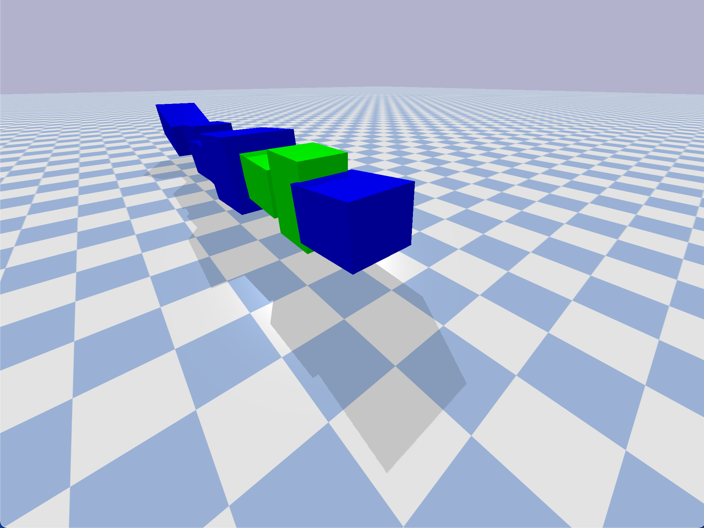

# My Bots

## Basic Idea
The program is intended to create a random kinematic chain. That is,
it will make a "snake" so to speak with a random number of segments,
randomly shaped segments, and random sensor placement along the snake.
Links with sensors are colored green, and links without sensors are
colored blue.

## Running the Program
Download the file and type `python3 search.py` into your terminal to
run. A python pop-up should appear with your kinematic chain. Run
again for a new chain.

## Images

## Credits
* Ludobots from Dr. Josh Bongard and the University of Vermont: <https://www.reddit.com/r/ludobots/wiki/installation/>
* Professor Sam Kriegman and Northwestern University's COMP_SCI 396: Artificial Life