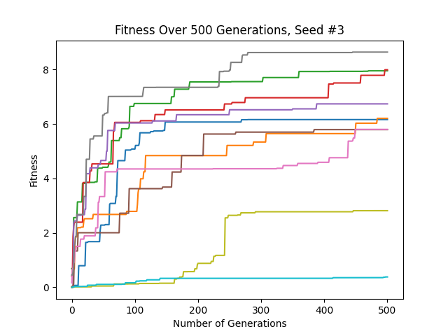
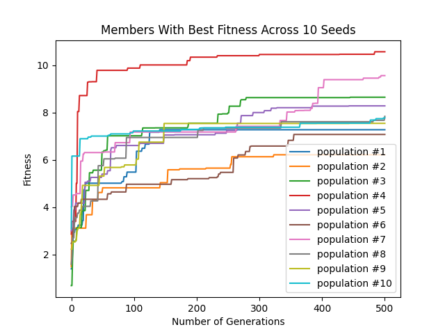

# Evolving 3D Robot

## Basic Idea
This program is designed to create a random, three-dimensional robot out of non-overlapping links and joints, with a 
brain of sensors, motors, and fully-connecting synapses. Then, it "evolves" the robotrobot through a Parallel Hill 
Climber method: a population of 10 (or less/more) robots are created randomly, then are randomly mutated from generation
to generation. If a mutation improves fitness, it is kept. If it does not, it is disgarded. The final shown robot is
the one that performs the best among the evolved population. Thefitness is a measure of how far in the negative X-axis
the robot can travel in a set amount of time. In the graphs below, a positive fitness is shown as better to improve
readability, but in reality, the more negative a fitness, the better.  

## In Depth
First, the code creates a random, three-dimensional body blueprint out of link and joint objects (defined in 
"linkobject.py" and "jointobject.py") in the file "bodyplan.py." It does so by picking a random number of links,
creating a base link (`Link0`), and then one by one, adding a joint and link onto a random face of a random already made
link. If the created joint/link pair overlaps with another, the whole process is scrapped and restarted. All links and
joints have their absolute positions calculated and stored in the link object, as well as the link's axis-aligned 
bounding box. This is then done 10 (`c.populationSize`) times, all a part of Generation #0.  
The robot moves via a network of sensors, motors, and synapses. Certain links are designated as sensors (green links 
are sensors, blue links are not), sending values of 1 or 0 if the link is in contact with the ground or not. Each joint 
on the robot is a motor, and the "brain" is a fully connected system, where there is a synapse between each sensor and
each motor. Each system is initialized with a random weight.  
Next, for each robot in the population, the code loops through each synapse and has a small chance of randomly 
reassigning the synapse a different weight. Then, it loops through each link, and for each dimension of each link, there
is a small chance that the link's size in that dimension is randomly reassigned. This mutation process could result in
many or few mutations. As the fitness of the robot increases, the odds of a synapse or link dimension mutating decrease.
This is because large mutations can assist a brand-new robot in getting on the right path, but large mutations of 
established robots are less likely to improve the fitness than smaller mutations.  
If a mutation proved successful, i.e. the fitness of the mutated robot was better than that of the original, the 
mutated robot replaces the original in the population and creates its own "children." Otherwise, the child is
erased, and the parent creates a new child. This evolution process takes place for 500 (`c.NumberOfGenerations`)
generations. Finally, we find the robot in the final generation with the best fitness in the population and displays it
in a Python GUI.

## Running the Program
Download the files and type `python3 search.py X` into your terminal to run, where _X_ is replaced with any number to
select the seed (it runs `np.random.seed(X)`). A python pop-up should appear with your random robot. Run again for a
new robot, and select a different seed, then back to the original to get replicate your ludobots. For my testing, I
used seeds 1, 2, ..., 10 (the image is saved to a file called "fitness*X*.png). Each simulation of a robot took about 0.2
seconds on my machine (ten generations with a population size of ten took about twenty seconds), although your machine might
be different. A run of 500 generations with a population size of 10 takes between fifteen and twenty minutes.  
If you also use seeds 1-10, you can afterwards run `python3 analyze.py` to create a graph of the fitness of the best robot
for any given generation among those ten seeds. They will all show up on the same graph, so you can compare runs against
each other!  
Finally, if you run `python3 showpickles.py X all` (again, where _X_ is replaced with any number to select the seed), you will
see a series of python pop-up windows, each showing a robot that is a little more fit than the last. These robots are/were
the fittest robots at the time, until the next shown robot evolved and took its place. They span the population, so the bodies
are the most fit across the population. Essentially, watching these robots is like watching the significant evolutions across
the whole evolutionary chain. If you want to watch one specific pickled robot, run `python3 showpickles.py X Y`, where _Y_ is
the number of the pickled robot you want to see (found at the end of the file "pickles/run*X*_pickle*Y*.pkl"). If you 
run this before you run `python3 search.py X`, you will see my results. If you run after, you'll see your results (although
they should be the same due to the random seed being the same for both).

## Constants
In the file "constants.py," there are a few variables used throughout the codebase that dictate a lot about how the robot
is generated and evolved. You can change these constants to tailor your evolutionary outcomes! Here are the constants and
their purposes:
* `steps`: the number of frames/refreshes a single simulation lasts (currently 1000)
* `numLinks`: the number of links a robot contains, excluding the base (currently set to a random number between 3 and 9)
* `numSensorNeurons`: the number of potential sensor neurons; the number of actual sensor neurons is between 0 and this 
number (currently set to `numLinks + 1`; DO NOT CHANGE)
* `numMotorNeurons`: the number of motor neurons (currently set to `numLinks`; DO NOT CHANGE)
* `motorJointRange`: the dampening factor on every joint's range of motion (currently set to 0.5)
  * `motorJointRange = 0`: the joints will not move
  * `motorJointRange = 1`: the joints will move their full range
  * I would recommend keeping this variable in the 0.2 - 0.6 range in order to keep motor behavior productive and realistic
* `numberOfGenerations`: the number of generations the simulation will run for, not including generation #0 (currently set to 500)
* `populationSize`: the number of robots in being evaluated concurrently in each generation (currently set to 10)

## Files and Descriptions
### analyze.py
* Graphs the fitness of the most fit robot over all generations for seeds 1-10
* Change the value in the first for loop range to change the number of seeds shown

### bodyplan.py
* Creates the blueprint for the robot's body
* Doesn't actually create the body

### constants.py
* Holds all the constants used throughout the codebase
* Described more thoroughly in the section above

### jointobject.py
* Defines the JOINT object
* Used for bodyplan.py

### linkobject.py
* Defines the LINK object
* Used for bodyplan.py

### motor.py
* Defines the MOTOR object
* Used to turn a joint into a motor for motion

### parallelhillclimber.py
* Handles the evolution process for all members of a population in parallel for however many generations defined
* For each generation:
  * Creates a set of "children" by cloning the previous generation
  * Mutates the children
  * Evaluates the children's fitness
  * Selects the fitter between a parent and a child to continue with
* Saves the population's fitness data into data/fitnessValues*X*.npy
* Pickles the fittest robot every time there is a new fittest robot

### robot.py
* Reads in values from the sensors
* Makes the motors act given a value from the sensors
* Updates the neural network and brain*X*.nndf file
* Records the robot's fitness

### search.py
* Runs the evolutionary process
* Shows the best robot after the final generation

### sensor.py
* Defines the SENSOR object
* Used to turn a link into a sensor for sensing

### showpickles.py
* Shows a pickled robot(s) from a previous run of search.py
* Can be used to show a specific robot from a seed or all of a seed's pickled robots sequentially

### simulate.py
* Runs a single simulation
* Gets the fitness after the simulation
* Can be used to run DIRECT (without showing you) or GUI (showing you)

### simulation.py
* Defines how a robot runs
* Gets the fitness of a simulation

### solution.py
* Initializes the world
* Reads from bodyplan.py to actually create the robot's body
* Creates the robot's brain
* Mutates the robot's brain and body

### world.py
* Loads the world and the floor

### world.sdf
* Describes the current world for pybullet
* Currently empty, so technically unnecessary; will be created upon running search.py if deleted
* This is where added world elements would show up

### data/
* Where numpy arrays of fitness values for various runs are stored
* Accessed by analyze.py to graph best fitness

### graphs/
* Where fitness graphs are stored
* Created after a run for a specific seed
* Where analyze.py stores its graph

### images/
* Where images are stored for this README.md file

### pickles/
* Where robots that improve the maximum fitness are stored
* Accessed by showpickles.py to show previous robots

### pyrosim/
* Where all the pyrosim code is stored
* I made a few changes to help my simulations; check out previous commits to this folder to see!

### Files That Running the Program Will Create
Some files that are important to the running of this program are not created until the run begins, and some are
subsequently deleted. They haven't been committed to this repository, as they'll be written over by your runs, but they
are as follows:
* body*X*.urdf
  * Stores the body for simulation number *X* in a language that pyrosim can understand
  * Deleted during run to avoid cluttering directory
* brain*X*.nndf
  * Stores the brain for simulation number *X* in a language that pyrosim can understand
  * Deleted during run to avoid cluttering directory
* fitness*X*.txt
  * Stores the fitness for simulation number *X* to be used across files
  * Deleted during run to avoid cluttering directory
* 1
  * Stores various pybullet and pyrosim print statements that print whenever the simulation is run
  * Stored here by the "2&>1" in the lines that run simulate.py in solution.py
  * If you customize this code, be aware that errors and warnings might end up in this file and not in the terminal. 
Delete the "2&>1" in solution.py to debug more easily

### Legacy Files
These are files that were used in previous branches, but no longer are utilized or in use. They are only kept in this
repository for legacy purposes.
* generate.py
  * Creates the world, body, and brain for simulations
  * Replaced by solution.py
* hillclimber.py
  * Handles the evolution process for however many generations defined
  * For each generation:
    * Creates a "child" by cloning the previous generation
    * Mutates the child
    * Evaluates the child's fitness
    * Selects the fitter between the parent and the child to continue with
  * Replaced by parallelhillclimber.py
  * If you set `c.populationSize = 1`, parallelhillclimber.py behaves as hillclimber.py did

## Images/Videos
### Creating a Robot:

### Mutating a Robot's Body:

### Mutating a Robot's Brain

### Example Robots:

### Example of Robot Evolution:

### Longer Video on Full Evolutionary Process:
<https://youtu.be/K4y3jUs4cLU>

### Fitness Graph (100 Generations, Population Size of 100):

### Fitness Graph (50 Generations, Population Size of 50):

### Fitness Graph (500 Generations, Population Size of 10, from This Experiment):

### Fitness Curves Across 10 Different Seeds, Showing the Fitness of the Best Robot at Every Given Generation:

## Results
As a general rule, the more generations there are, the better a robot's end fitness is. This is to be expected, as a
robot's fitness can never get worse. Usually, the best robots of a population ended with a fitness of around -7 or -8.
However, there were some outliers. Seed #4's best robot reached an all-time best fitness of -10, ending around -10.4.
On the other hand, seed #2's best robot only got to just below -6, which was quite low for a best robot.  
There were also some trends I noticed in the body shapes of successful robots. Robots with good fitnesses tended to have
a sort of hopping motion, jumping along on one "foot," a lowermost sensor link that propelled it forward. There were 
also a few robots that had a similar strategy for motion, just adding a second leg to help balance (one-legged hopping
robots often fell over towards the end of the simulation). Another observation I made is that smaller robots (either
less links or links of smaller size) tended to be more likely to succeed. Finally, early on in my coding, successful
robots tended to be really tall and just sort of fall over. I felt that this was against the spirit of the experiment, 
so I added a "ceiling" that blocks can't be generated past, and this prevented this from happen. However, there was one
very clever robot (I believe seed #7) that coiled itself up in order to spring out and flop over. I decided to leave it
in due to its determination.

## Credits
* Ludobots from Dr. Josh Bongard and the University of Vermont: <https://www.reddit.com/r/ludobots/wiki/installation/>
* PyroSim: <https://www.thunderheadeng.com/pyrosim>
* Professor Sam Kriegman and Northwestern University's COMP_SCI 396: Artificial Life
* Inspiration for work and diagrams from Karl Sims' research
